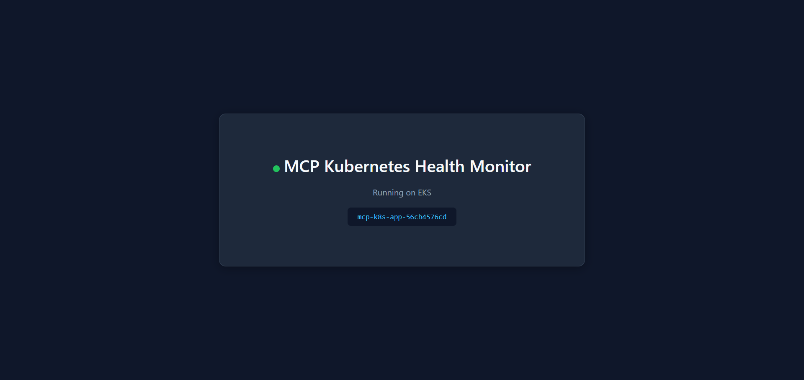
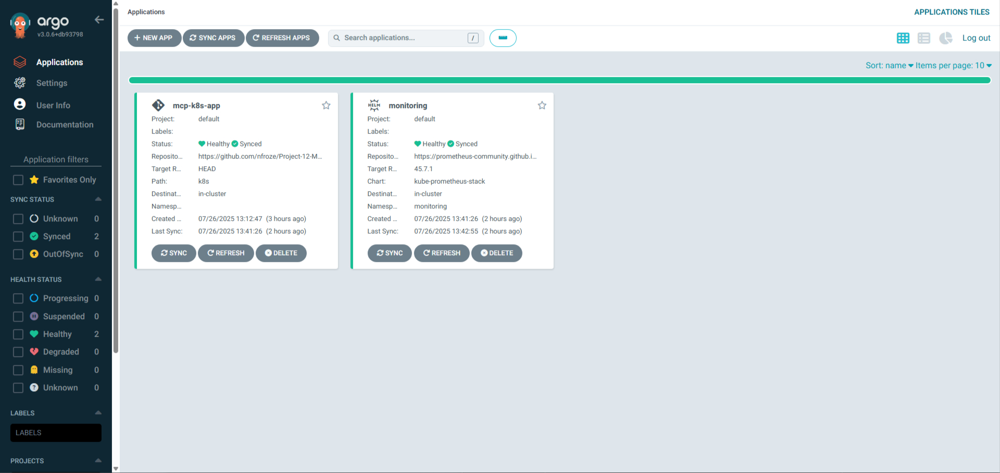

# MCP Kubernetes Health Monitor

A custom Model Context Protocol (MCP) server that enables natural language querying of Kubernetes cluster health, deployed on AWS EKS with GitOps automation and a full DevSecOps pipeline.

## Overview

Platform teams need visibility into cluster health without constantly switching between kubectl commands, dashboards, and alerting systems. This project solves that by creating an MCP server that exposes Kubernetes operational data through natural language interfaces—enabling AI assistants to answer questions like "show me unhealthy pods" or "generate a cluster health report" directly from conversation.

The system integrates three distinct concerns: infrastructure provisioning via Terraform, continuous deployment via ArgoCD, and security scanning via a multi-tool pipeline. The MCP server itself connects to the Kubernetes API to extract pod health status, node resource metrics, and namespace-level resource allocation, then formats this data for AI consumption.

This architecture demonstrates production-ready thinking: infrastructure as code for reproducibility, GitOps for declarative deployments, shift-left security scanning, and observability through Prometheus and Grafana. Each component is designed to work independently while integrating cleanly with the others.

## Architecture

The architecture follows a hub-and-spoke model with AWS EKS at the centre. Terraform provisions the foundational infrastructure—VPC with public/private subnets across availability zones, the EKS cluster with managed node groups, IAM roles for service accounts (IRSA), and cluster add-ons including CoreDNS, VPC CNI, and the EBS CSI driver.

ArgoCD watches the Git repository and automatically syncs Kubernetes manifests to the cluster. Two ArgoCD Applications handle deployment: one for the sample application running in the `mcp-app` namespace, another for the kube-prometheus-stack providing Prometheus and Grafana in the `monitoring` namespace.

The MCP server runs locally, connecting to the cluster via kubeconfig. It exposes three tools through the Model Context Protocol: `get_unhealthy_pods` for identifying problem workloads, `get_resource_usage` for node and namespace-level metrics, and `generate_health_report` for comprehensive cluster assessments.

GitHub Actions pipelines enforce security at commit time—Checkov scans Terraform for misconfigurations, while Semgrep, Gitleaks, and Trivy scan application code and container images before they reach the registry.

## Tech Stack

**Infrastructure**: AWS EKS, Terraform, VPC, IAM (IRSA)

**CI/CD**: GitHub Actions, ArgoCD, Docker

**Monitoring**: Prometheus, Grafana (kube-prometheus-stack)

**Security**: Checkov, Semgrep, Gitleaks, Trivy

**Application**: Node.js, Model Context Protocol SDK, Kubernetes Client

## Key Decisions

- **MCP over REST API**: The Model Context Protocol provides a standardised interface for AI assistants to discover and invoke tools dynamically. This future-proofs the solution as AI capabilities evolve, rather than building bespoke integrations.

- **ArgoCD with automated sync and self-heal**: Enabling `prune: true` and `selfHeal: true` ensures the cluster state always matches Git. Manual interventions are automatically reverted, enforcing GitOps discipline and preventing configuration drift.

- **Multi-scanner security pipeline**: Rather than relying on a single tool, the pipeline chains Semgrep (SAST), Gitleaks (secrets detection), and Trivy (dependency and container scanning). Each tool catches different vulnerability classes, providing defence in depth.

- **IRSA for AWS Load Balancer Controller**: Using IAM Roles for Service Accounts instead of node-level IAM permissions follows the principle of least privilege. The load balancer controller only gets the specific permissions it needs, scoped to its service account.

## Screenshots

## Author

**Noah Frost**

- Website: [noahfrost.co.uk](https://noahfrost.co.uk)
- GitHub: [github.com/nfroze](https://github.com/nfroze)
- LinkedIn: [linkedin.com/in/nfroze](https://linkedin.com/in/nfroze)